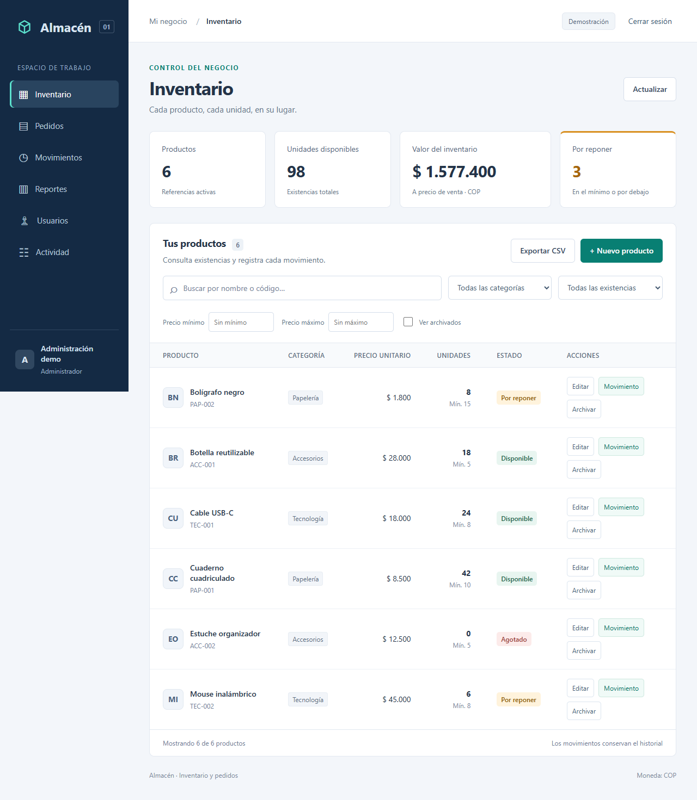

# Almacén · Inventario y pedidos

Aplicación web para una tienda de productos generales. Permite gestionar existencias, registrar pedidos, controlar permisos y consultar reportes. La creación de un pedido y el descuento de unidades se guardan en una sola transacción: dos pedidos simultáneos no pueden vender la misma última unidad.

**React 19 · TypeScript · Node.js 24 · PostgreSQL · Vite · Playwright**



## Ejecutar en tres pasos

Requiere **Node.js 24 o superior**. Descarga o clona el repositorio y abre una terminal en su carpeta:

```text
npm ci
npm run build
npm start
```

Abre **http://127.0.0.1:4317**. Sin configuración adicional se inicia una demo con seis productos y PostgreSQL integrado mediante [PGlite](https://pglite.dev/docs/). Guarda los datos en `data/postgres`; no hace falta instalar un servidor PostgreSQL para esta modalidad.

### Cuentas de demostración

| Rol           | Correo                   | Contraseña pública de demo |
| ------------- | ------------------------ | -------------------------- |
| Administrador | `admin@almacen.local`    | `AprendeInventario2026!`   |
| Operador      | `operador@almacen.local` | `AprendeInventario2026!`   |

La pantalla de acceso incluye botones para explorar ambos roles en modo demo. Estas cuentas son de ejemplo; el modo de producción utiliza una base nueva y un administrador configurado por variables de entorno.

## Funcionalidades

- Catálogo: creación, edición, archivado y restauración de productos con códigos únicos.
- Búsqueda por nombre/código y filtros por categoría, existencias y rango de precios.
- Entradas y salidas con motivo, fecha y responsable.
- Pedidos con múltiples productos y precios históricos, calculados en el servidor.
- Cancelación de pedidos con devolución de unidades y protección contra devoluciones duplicadas.
- Idempotencia: reintentar la misma creación no duplica el pedido ni sus movimientos.
- Reportes de inventario, ventas, categorías y productos más vendidos.
- Exportación CSV de productos filtrados, pedidos, movimientos y ventas.
- Sesiones con cookies HttpOnly, protección CSRF, contraseñas con scrypt y límite de intentos de acceso.
- Gestión de usuarios y registro de actividad de administradores.
- Interfaz adaptable a móvil con formularios etiquetados y diálogos operables con teclado.

### Permisos

| Acción                                              | Administrador | Operador |
| --------------------------------------------------- | ------------- | -------- |
| Consultar catálogo, movimientos, pedidos y reportes | Sí            | Sí       |
| Registrar movimientos y pedidos                     | Sí            | Sí       |
| Crear, editar, archivar y restaurar productos       | Sí            | No       |
| Cancelar pedidos                                    | Sí            | No       |
| Gestionar usuarios y consultar actividad            | Sí            | No       |

Las restricciones se verifican en el servidor. Cambiar el rol, estado o contraseña invalida las sesiones del usuario. Debe permanecer al menos un administrador activo.

## Pruebas

```text
npm run build
npm test
npx playwright install chromium
npm run test:e2e
```

Las **23 pruebas de comportamiento** verifican validaciones, existencias, precios históricos, reversión de pedidos fallidos, concurrencia, idempotencia, cancelaciones, reportes, sesiones, permisos, CSRF, límite de acceso y persistencia. Los **dos flujos de navegador** recorren catálogo, pedido, cancelación, reportes, usuarios, CSV, archivado, sesión y vista móvil.

`npm run format` mantiene el código legible con Prettier. `npm run check` comprueba formato, tipos, build y pruebas de comportamiento; los flujos de navegador se ejecutan aparte.

GitHub Actions está configurado para ejecutar el build, estas pruebas y otra ejecución contra un servicio **PostgreSQL 17**. El flujo se comprobará en GitHub al publicar el repositorio; no se presenta como ya ejecutado allí.

## PostgreSQL externo y despliegue

La aplicación usa las mismas migraciones y consultas SQL para PGlite y para un servidor PostgreSQL conectado mediante `pg`. Define `DATABASE_URL` para seleccionar el servidor externo.

- [Configuración local, Docker y despliegue](docs/despliegue.md)
- [Guía para publicar en GitHub](docs/subir-a-github.md)

Se incluye Dockerfile, Compose para PostgreSQL y ejemplos de configuración. El repositorio contiene el código de la demo; aún no tiene una URL pública. GitHub Pages no ejecuta este servidor Node.

## Arquitectura

```text
Interfaz React + TypeScript
        │ HTTP JSON + cookie de sesión + token CSRF
Servidor Node.js / rutas y autorización
        │
Servicios / validaciones y transacciones
        │
PostgreSQL externo o PostgreSQL integrado (PGlite)
```

```text
client/                 Componentes React, estado, filtros y peticiones
src/server.ts           Rutas, sesiones, autorización y entrega del build
src/auth.ts             Contraseñas, sesiones y usuarios
src/service.ts          Reglas de inventario, pedidos, reportes y auditoría
src/database.ts         Adaptadores de PostgreSQL y migraciones
src/migrations/         Esquema versionado
src/types.ts            Tipos compartidos
test/app.test.ts        Pruebas de comportamiento y API
e2e/workflows.spec.ts   Flujos de navegador
docs/                   API, arquitectura, aprendizaje y publicación
```

### Decisiones importantes

**Dinero en centavos enteros.** Los precios y los totales de cada pedido se calculan con enteros y se validan sus límites.

**Transacciones y bloqueos de fila.** Un pedido bloquea sus productos en orden de identificador, comprueba unidades, guarda líneas, descuenta existencias y registra movimientos. Cualquier fallo revierte la operación completa.

**Precios históricos.** Cada línea guarda código, nombre y precio en el momento de la venta. Editar el catálogo no cambia pedidos anteriores.

**Archivado en vez de pérdida de historial.** Un producto archivado conserva movimientos y pedidos; deja de estar disponible para nuevas operaciones hasta que se restaure.

**Sesiones en servidor.** El navegador no guarda credenciales en localStorage. La base almacena el hash del token de sesión; la cookie es HttpOnly y lleva Secure en producción.

**Idempotencia por usuario.** Cada borrador genera una clave. El servidor vincula esa clave al contenido del pedido y devuelve el pedido existente en reintentos idénticos.

## Aprender con el proyecto

- [Primera lectura: interfaz, servidor y SQL](docs/01-primer-recorrido.md)
- [Arquitectura y flujo de un pedido](docs/arquitectura.md)
- [API y ejemplos](docs/api.md)
- [Ejercicios y plan de estudio](docs/roadmap.md)

El proyecto parte de conocimientos de variables, funciones y HTML/CSS. Las guías permiten estudiar el código completo por partes y hacer mejoras propias.

## Alcance y validación

Una tienda, productos vendidos por unidades enteras y una moneda: COP. No incluye facturación electrónica, cobros reales ni múltiples sucursales. La interfaz muestra hasta 200 pedidos y 500 movimientos recientes; los reportes usan la información completa guardada.

Build, 23 pruebas y dos flujos de navegador verificados localmente con PostgreSQL integrado. La ejecución en PostgreSQL externo y Docker está preparada en CI/configuración; no se ha ejecutado localmente porque el motor Docker no está activo. No se ha desplegado públicamente.

Los datos anteriores de la primera etapa SQLite permanecen en `data/inventory.sqlite`. En modo demo, se importan con su historial si la base nueva está vacía; la base original no se modifica. Esta versión usa `data/postgres`. Datos locales, `.env`, builds y resultados de pruebas están excluidos de Git.

## Licencia

[MIT](LICENSE).
